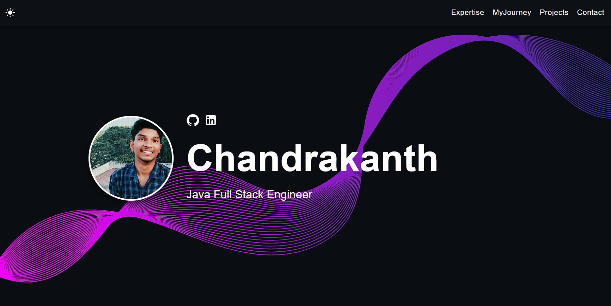

<<<<<<< HEAD
# Developer Portfolio Template 🚀

      

## What is this?

This simple portfolio template is designed to showcase your past projects, career history, skill sets, and more.

View the [Demo](https://chan-prakash.github.io/portfolio_New/).

**This template is free to use, and no attribution is required.** You can fork or download this repository to customize it for your own use. Please don't forget to leave a ⭐ if you like this portfolio!



## Features

✅ Open source (free to use, no attribution required)  
✅ Responsive design & mobile-friendly  
✅ Supports both dark and light modes  
✅ Highly customizable multi-component layout  
✅ Built with modern technologies (React, TypeScript, JavaScript, and SCSS)  

## Quick Setup

1. Ensure you have [Node.js](https://nodejs.org/) installed. Check your installation by running:

    ```bash
    node -v
    ```

2. In the project directory, install dependencies:

    ```bash
    npm install
    ```

3. Start the development server:

    ```bash
    npm start
    ```

4. Open [http://localhost:3000](http://localhost:3000) to view the app in the browser.

5. Customize the template by navigating to the `/src/components` directory. Modify texts, pictures, and other information as needed.

The page will reload if you make edits, and you will see any lint errors in the console.

If you are interested in creating a mockup image like the ones from the personal projects section, I recommend [Genmoo](https://gemoo.com/tools/browser-mockup-generator/). This website lets you generate sleek looking browser mockups for free.

## Deployment

You can choose your preferred service (e.g., [Netlify](https://www.netlify.com/), [Render](https://render.com/), [Heroku](https://www.heroku.com/)) for deployment. One of the easiest ways to host this portfolio is using GitHub Pages. Follow the instructions below for a production deploy.

1. **Set Up GitHub Repository**

    Create a new repository on GitHub for your portfolio app.

2. **Configure `package.json`**

    Edit the following properties in your `package.json` file:

    ```json
    {
        "homepage": "https://yourusername.github.io/your-repo-name",
        "scripts": {
            "predeploy": "npm run build",
            "deploy": "gh-pages -d build",
            ...
        }
    }
    ```

    Replace `yourusername` with your GitHub username and `your-repo-name` with the name of your GitHub repository.

3. **Deploy to GitHub Pages**

    Run the following command to deploy your app:

    ```bash
    npm run deploy
    ```

4. **Access Your Deployed App**

    After successfully deploying, you can access your app at `https://yourusername.github.io/your-repo-name`.
=======
# portfolio_New
# 🚀 Chandrakanth's Personal Portfolio

Welcome to my portfolio! I'm **Chandrakanth P**, a tech enthusiast, Java Full Stack Developer, and aspiring Solution Architect. This portfolio showcases my personal projects, UI/UX design work, certifications, and technical journey through development and cloud platforms.

## 📌 Table of Contents
- [About Me](#about-me)
- [Projects](#projects)
- [Certifications](#certifications)
- [Tech Stack](#tech-stack)
- [Contact](#contact)

---

## 🧑‍💻 About Me

I am a 3rd-year Electronics and Instrumentation Engineering student at SRM University, passionate about full-stack development, cloud computing, and UI/UX design. I've worked on several academic and personal projects, earned AWS and Java certifications, and continue exploring backend technologies and scalable web solutions.

---

## 🧱 Projects

### 🔐 [CloudVault](https://github.com/Chan-prakash/CloudVault)
A secure cloud storage platform with user authentication and file operations.  
**Tech Used:** PHP, MySQL, JavaScript, HTML, CSS  
- Built custom file upload, download, and sharing features  
- Ensured security for user data and file access  
- Designed intuitive UI for seamless interaction  

---

### 👟 [SneakersHub](https://github.com/Chan-prakash/SneakersHub)
An e-commerce website built for sneaker lovers with a clean UI and product filtering.  
**Tech Used:** HTML, CSS, JavaScript, Bootstrap  
- Created dynamic product listings and cart  
- Focused on responsive UI design for all devices  
- Implemented smooth transitions and hover effects  

---

### 🌐 [NOMIZO'24 Symposium Website](https://github.com/Chan-prakash/nomizo)
Official symposium website for SRM University's national tech fest.  
**Tech Used:** HTML, CSS, JavaScript, GitHub, Vercel  
- Deployed on Vercel with CI/CD integration  
- Managed event schedule, gallery, and team sections  
- Mobile-first responsive layout with smooth navigation  

---

### 🌾 [GrainyX - Mobile App UI (Figma)](https://www.figma.com/proto/6rThsMifE0ufhiD9AgKSlJ/Grainyx?node-id=0-1)
A UI/UX design concept to connect farmers directly with consumers.  
**Tech Used:** Figma  
- Designed user flows for produce listings, deals, and messaging  
- Prioritized accessibility and ease of navigation  
- Built during Smart India Hackathon submission phase  

---

### 🎨 [Portfolio UI Design (Figma)](https://www.figma.com/design/12YfhiF17zFMGWtTVfcZth/Untitled?node-id=63-519&t=GOE8Gghd0Rw8PomJ-0)
Figma-based UI layout for a developer portfolio.  
**Tech Used:** Figma  
- Sections include About, Skills, Projects, and Contact  
- Clean minimalist layout with modern visual hierarchy  
- Designed for future conversion to a React-based personal site  

---

## 📚 Certifications

- **Java Full Stack Developer** – EduSkills AICTE (2024)  
- **AWS Cloud Architecting** – AWS Academy (2024)  
- **AWS Cloud Foundations** – AWS Academy (2024)  
- **Certified Java Programming** – CodeTantra (2023)  
- **Java 5-Star Badge** – HackerRank  

---

## 🛠 Tech Stack

**Languages:** Java, JavaScript, PHP, Python, SQL, HTML, CSS  
**Frameworks:** Spring Boot, Hibernate, Bootstrap  
**Databases:** MySQL, PostgreSQL  
**Tools:** Figma, Git, GitHub, VS Code, Vercel  
**Cloud:** AWS, GitHub Pages  

---

## 📫 Contact

- 🌐 Website: [chanprakash.com](https://chanprakash.com)
- 💼 LinkedIn: [Chandrakanth on LinkedIn](https://www.linkedin.com/in/chandrakanth-prakash-68b28b253)
- 🧠 GitHub: [Chan-prakash](https://github.com/Chan-prakash)
- 📧 Email: chan26prakash@gmail.com

---

> 🚧 *This portfolio is actively maintained and growing as I explore new technologies and complete new challenges. Stay tuned for updates!*
>>>>>>> f4cda1fd1ad58dbb9662bd724256c613cef5354c
